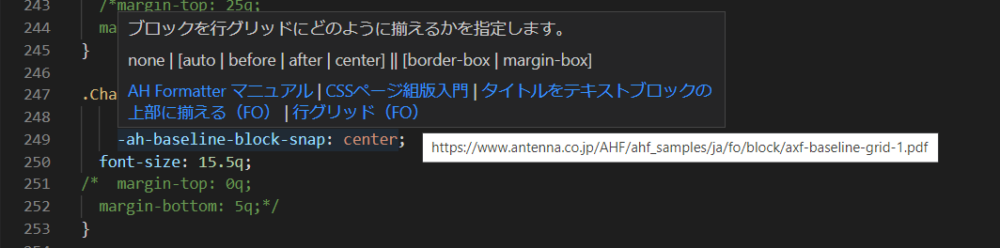

# AH Formatter CSS 拡張プロパティ

[AH Formatter](https://www.antenna.co.jp/AHF)拡張の [CSS プロパティ](https://www.antenna.co.jp/AHF/help/ja/ahf-focss6.html)に、オートコンプリートやホバー情報を CSS ファイルで提供する VS Code 拡張です。

この拡張機能は、グローバルまたは個々のワークスペースに対して有効にすることができます。

この拡張機能は、[vscode-custom-data](https://github.com/microsoft/vscode-custom-data)形式と[`contributes.css.customData` Contribution Point](https://code.visualstudio.com/api/extension-guides/custom-data-extension)を使用しています。

**ahformatter-vscode-css-ja** 版の番号は、リリース時の AH Formatter のバージョンに対応しています。

## インストール

拡張機能は、以下の方法でインストールすることができます。

<!-- - 拡張機能パネルで 「AH Formatter CSS 拡張プロパティ」 を検索し、インストールする。
- [Marketplace](https://marketplace.visualstudio.com/items?itemName=antennahouse.ahformatter-vscode-css-ja)からダウンロード-->
- [GitHub Release](https://github.com/AntennaHouse/ahformatter-vscode-css-ja/releases)ページからのダウンロード

## デモ

## 参考資料

ホバー情報には、4種類の参考資料へのリンクを設定することができます。

- 「AH Formatter マニュアル」 - AH Formatter マニュアルにあるプロパティ定義へのリンク
- 「XSL 1.1」 - XSL 1.1プロパティの定義へのリンク。拡張されていないXSL-FOプロパティの場合のみ存在します。
- 「Introduction to CSS for Paged Media」 - [Introduction to CSS for Paged Media](https://www.antennahouse.com/css) bookのプロパティ情報へのリンクです。
- 「*Title* (FO)」 - プロパティの使用例を示すPDFサンプルへのリンク。PDFはXSL-FOのソースから生成されていますが、プロパティの使い方は同じです。

## ライセンス

[MIT](LICENSE)
